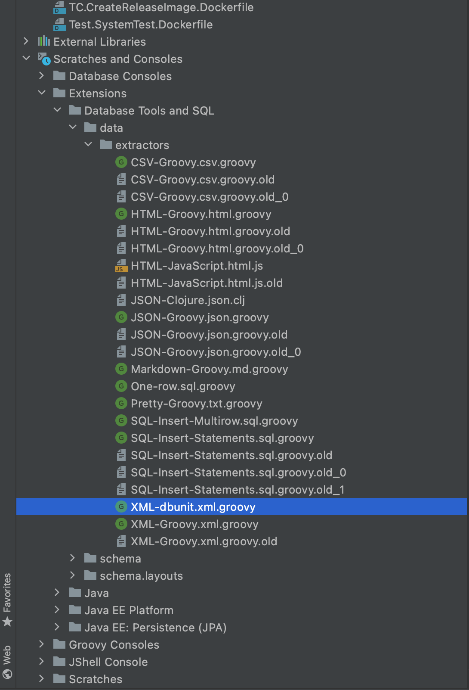
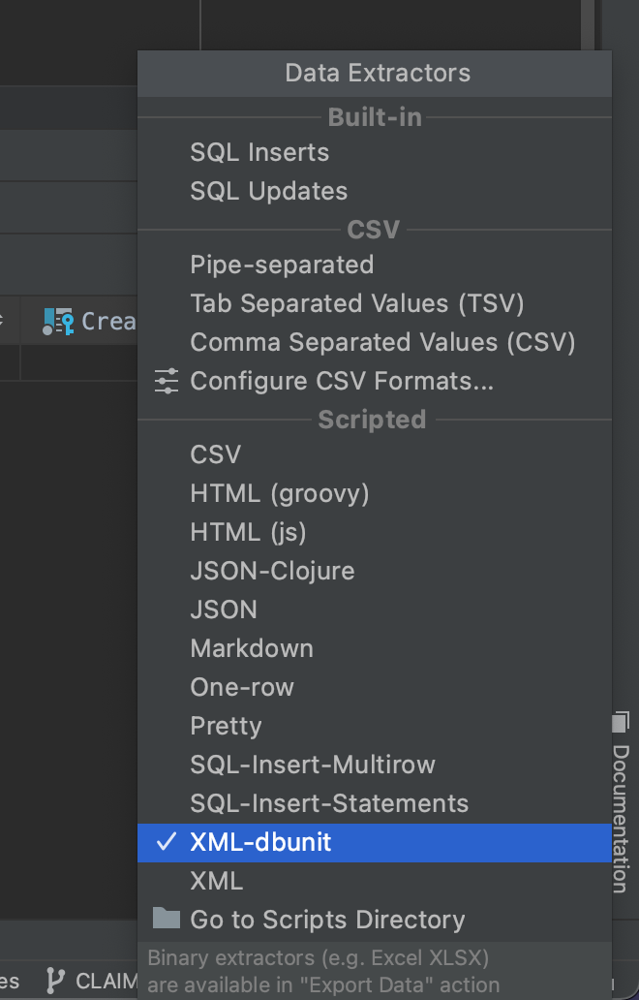

# dbunit data extractor for IntelliJ

This is a quick way to write a dataset for dbunit. Useful if you need to have a large dataset, or if you think life is too short and precious to spend it editing XML.

Data extractors lets you extract and export the results of a SQL query. However, the XML data extractor does so in a format that is not compatible with dbunit. To avoid having to reformat the XML, use this dbunit data extractor instead.

## Install

As described in the documentation,

1. In the _Project_ tool window (_View_ | _Tool Windows_ | _Project_ ), navigate to _Scratches and Consoles_ | _Extensions_ | _Database Tools and SQL_ | _data_ | _extractors_.
2. Create a new file named _XML-dbunit.xml.groovy_
3. Paste in the [code](XML-dbunit.xml.groovy)

## Usage

Generate your dataset by writing a query and running it (you should do this one table at a time, typically SELECT * FROM ..., limited to one or as many rows you need).

Select XML-dbunit from the list of extractors.

